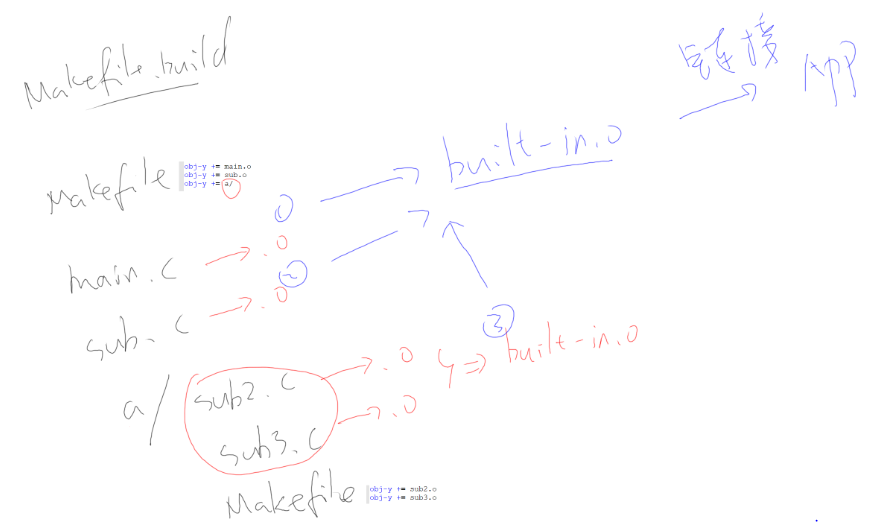
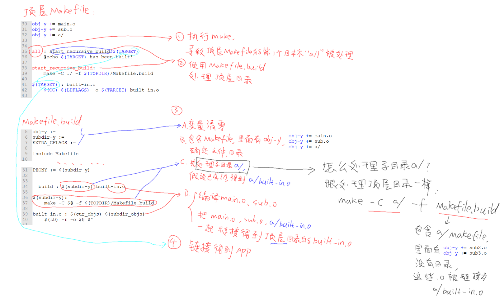

```Text
Author: Antony_Weng <weng851107@gmail.com>

This file is only used for the record of the learning process, only used by myself and the file has never been leaked out.
If there is related infringement or violation of related regulations, please contact me and the related files will be deleted immediately. Thank you!
```

# 目錄

- [Note](#0)
- [筆記](#1)
  - [關於gcc、make和CMake的區別](#1.0)
  - [Makefile要達成的效果](#1.1)
  - [Makefile的引入與規則](#1.2)
  - [Makefile的語法](#1.3)
  - [Makefile函數](#1.4)
  - [Makefile實例](#1.5)
  - [通用Makefile的使用](#1.6)
    - [通用Makefile的設計思想](#1.6.0)
    - [一、各級子目錄的Makefile](#1.6.1)
    - [二、頂層目錄的Makefile](#1.6.2)
    - [三、頂層目錄的Makefile.build](#1.6.3)
    - [四、怎麼使用這套Makefile](#1.6.4)
  - [通用Makefile的解析](#1.7)
  - [簡介buildroot](#1.8)
  - [靜動態庫](#1.9)
  - [參考範例](#1.10)
  - [指示符include](#1.11)
- [GNU_Make](#2)
  - [Writing Makefiles](#2.1)
    - [What Makefiles Contain](#2.1.1)
    - [What Name to Give Your Makefile](#2.1.2)
    - [Including Other Makefiles](#2.1.3)
    - [How Makefiles Prevent from Remaking](#2.1.4)
    - [How make Reads a Makefile](#2.1.5)
  - [Writing Rules](#2.2)
    - [Rule Syntax](#2.2.1)
    - [Types of Prerequisites](#2.2.2)
    - [Using Wildcard Characters in File Names](#2.2.3)


<h1 id="1">筆記</h1>

[Makefile學習教程: 跟我一起寫 Makefile](https://blog.xuite.net/tzeng015/twblog/113272267-Makefile%E5%AD%B8%E7%BF%92%E6%95%99%E7%A8%8B%3A+%E8%B7%9F%E6%88%91%E4%B8%80%E8%B5%B7%E5%AF%AB+Makefile)

<h2 id="1.0">關於gcc、make和CMake的區別</h2>

https://www.cnblogs.com/xuelisheng/p/9988626.html

- CMake是一種跨平台編譯工具，比make更為高級，使用起來要方便得多。 CMake主要是編寫CMakeLists.txt文件，然後用cmake命令將CMakeLists.txt文件轉化為make所需要的makefile文件，最後用make命令編譯源碼生成可執行程序或共享庫（so(shared object)）.它的作用和qt的qmake是相似的。
- gcc是GNU Compiler Collection（就是GNU編譯器套件），也可以簡單認為是編譯器
- make工具可以看成是一個智能的批處理工具，它本身並沒有編譯和鏈接的功能，而是用類似於批處理的方式—通過調用makefile文件中用戶指定的命令來進行編譯和鏈接的。
- cmake是make maker

<h2 id="1.1">Makefile要達成的效果</h2>

- 為了能夠高效地編譯程序

- 組織管理程序

- 決定要編譯哪一個文件

- make命令所執行的動作依賴於Makefile文件

<h2 id="1.2">Makefile的引入與規則</h2>

### Makefile的引入

- 我們知道.c程序 ==》 得到可執行程序它們之間要經過四個步驟：
    1. 預處理
    2. 編譯
    3. 彙編
    4. 鏈接

- 我們經常把前三個步驟統稱為編譯了。

- 我們具體分析：`gcc -o test a.c b.c`這條命令，它們要經過下面幾個步驟：
    1）對於**a.c**：執行：預處理 編譯 彙編 的過程，**a.c ==>xxx.s ==>xxx.o** 文件。
    2）對於**b.c**：執行：預處理 編譯 彙編 的過程，**b.c ==>yyy.s ==>yyy.o** 文件。
    3）最後：**xxx.o**和**yyy.o**鏈接在一起得到一個**test**應用程序。

    提示：**gcc -o test a.c b.c -v** ：加上一個 `-v` 選項可以看到它們的處理過程，

- 第一次編譯 a.c 得到 xxx.o 文件，這是很合乎情理的， 執行完第一次之後，如果修改 a.c 又再次執行：`gcc -o test a.c b.c`，對於 a.c 應該重新生成 xxx.o，但是對於 b.c 又會重新編譯一次，這完全沒有必要，b.c 根本沒有修改，直接使用第一次生成的 yyy.o 文件就可以了。

- 因此，對於這些源文件，我們應該分別處理，執行：預處理 編譯 彙編，先分別編譯它們，最後再把它們鏈接在一次，比如：

  - 編譯：

    ```bash
    gcc -o a.o a.c
    gcc -o b.o b.c
    ```

  - 鏈接：

    ```bash
    gcc -o test a.o b.o
    ```

- 比如：上面的例子，當我們修改a.c之後,a.c會重現編譯然後再把它們鏈接在一起就可以了。 `b.c`就不需要重新編譯。

- 如何知道哪些文件被更新了/被修改了？ --> `比較時間`
  - 比較 a.o 和 a.c 的時間，如果a.c的時間比 a.o 的時間更加新的話，就表明 a.c 被修改了，同理b.o和b.c也會進行同樣的比較。
  - 比較test和 a.o,b.o 的時間，如果a.o或者b.o的時間比test更加新的話，就表明應該重新生成test。

### Makefile的規則

makefie最基本的語法是規則，規則：

```bash
目標(target) : 依賴1 依賴2 (prerequires)...
<TAB>命令(command)
```

- 目標(target)通常是要生成的文件的名稱，可以是可執行文件或OBJ文件，也可以是一個執行的動作名稱，諸如 `clean`。

- 依賴是用來產生目標的材料(比如源文件)，一個目標經常有幾個依賴。

- 命令是生成目標時執行的動作，一個規則可以含有幾個命令，每個命令佔一行。每個命令行前面必須是一個Tab字符，即命令行第一個字符是Tab

當**依賴**比**目標**新，執行它們下面的命令。我們要把上面三個命令寫成makefile規則，如下：

```bash
test ：a.o b.o  //test是目標，它依賴於a.o b.o文件，一旦a.o或者b.o比test新的時候，，就需要執行下面的命令，重新生成test可執行程序。
gcc -o test a.o b.o

a.o : a.c  //a.o依賴於a.c，當a.c更加新的話，執行下面的命令來生成a.o
gcc -c -o a.o a.c

b.o : b.c  //b.o依賴於b.c,當b.c更加新的話，執行下面的命令，來生成b.o
gcc -c -o b.o b.c
```

範例: [001_test_app](./source/04_2018_Makefile/001_test_app/)

編寫Makefile文件時，要使用Tab來作縮排，不可以使用空格

執行make命令時如果不指定目標，那麼它默認是去生成第1個目標。所以 `第1個目標`，位置很重要。有時候不太方便把第1個目標完整地放在文件前面，這時可以在文件的前面直接放置目標，在後面再完善它的依賴與命令。

比如：

```bash
First_target:         // 這句話放在前面

．．．．// 其他代碼，比如include其他文件得到後面的xxx變量

First_target : $(xxx) $(yyy)   // 在文件的後面再來完善
    command
```

<h2 id="1.3">Makefile的語法</h2>

### make命令的使用

- 執行make命令時，它會去當前目錄下查找名為 `Makefile` 的文件，並根據它的指示去執行操作，生成第一個目標。

- 我們可以使用 `-f` 選項指定文件，不再使用名為 `Makefile` 的文件，比如：

    ```bash
    make  -f  Makefile.build 
    ```

- 我們可以使用 `-C` 選項指定目錄，切換到其他目錄裡去，比如：

    ```bash
    make -C  a/  -f  Makefile.build 
    ```

- 我們可以指定目標，不再默認生成第一個目標：

    ```bash
    make -C  a/  -f  Makefile.build  other_target
    ```

### Patten - 通配符

- 假如一個目標文件所依賴的依賴文件很多時，我們可以使用通配符，來解決這些繁瑣問題。

    ```bash
    test ：a.o b.o c.o
    gcc -o test a.o b.o

    a.o : a.c
    gcc -c -o a.o a.c

    b.o : b.c
    gcc -c -o b.o b.c

    c.o : c.c
    gcc -c -o c.o c.c
    ```

    ```bash
    test: a.o b.o 
        gcc -o test $^
        
    %.o : %.c
        gcc -c -o $@ $<
    ```

    %.o：表示所用的.o文件
    %.c：表示所有的.c文件
    \$\@：表示目標
    \$\<：表示第1個依賴文件
    \$\^：表示所有依賴文件

- 範例：[001_patten](./source/04_2018_Makefile/002_syntax/001_patten/)

### 假想目標 .PHONY

1. 我們想清除文件，我們在Makefile的結尾添加如下代碼就可以了：

    ```bash
    test: a.o b.o c.o
        gcc -o test $^
        
    %.o : %.c
        gcc -c -o $@ $<

    clean:
        rm *.o test
    ```

    1）執行 make ：生成第一個可執行文件。
    2）執行 make clean : 清除所有文件，即執行： rm \*.o test。

- make後面可以帶上目標名，也可以不帶，如果不帶目標名的話它就想生成第一個規則裡面的第一個目標。這個寫法有些問題，原因是我們的目錄裡面沒有 clean 這個文件，這個規則執行的條件成立，他就會執行下面的命令來刪除文件。
  - 如果：該目錄下面有名為clean文件怎麼辦呢？

    ```bash
    make: `clean` is up to date.
    ```

  - 它根本沒有執行我們的刪除操作，這是為什麼呢？
  - 現在我們的目錄裡面有名為“clean”的文件，目標文件是有的，並且沒有依賴文件，沒有辦法判斷依賴文件的時間。這種寫法會導致：有同名的"clean"文件時，就沒有辦法執行make clean操作。

- 一個規則能過執行的條件：
  1. 目標文件不存在
  2. 依賴文件比目標新

- 解決辦法：我們需要把目標定義為假象目標，用**關鍵子PHONY**

    ```bash
    # 把clean定義為假象目標。他就不會判斷名為"clean"的文件是否存在
    .PHONY: clean 
    ```

### 變量

在makefile中有兩種變量：

1. 簡單變量(即使變量)：

    ```makefile
    A := xxx    # A的值即刻確定，在定義時即確定
    ```

    對於即使變量使用 `:=` 表示，它的值在定義的時候已經被確定了

2. 延時變量

    ```makefile
    B = xxx   # B的值使用到時才確定
    ```

    對於延時變量使用 `=` 表示。它只有在使用到的時候才確定，在定義/等於時並沒有確定下來。

想使用變量的時候使用`$`來引用

如果不想看到命令是，可以在命令的前面加上`@`符號，就不會顯示命令本身。

當我們執行make命令的時候，make這個指令本身，會把整個Makefile讀進去，進行全部分析，然後解析裡面的變量。常用的變量的定義如下：

```bash
:=      # 即時變量
=       # 延時變量
?=      # 延時變量, 如果是第1次定義才起效, 如果在前面該變量已定義則忽略這句
+=      # 附加, 它是即時變量還是延時變量取決於前面的定義
?=:     # 如果這個變量在前面已經被定義了，這句話就會不會起效果，
```

實例：

```bash
A := $(C)
B = $(C)
C = abc

#D = 100ask
D ?= weidongshan

all:
    @echo A = $(A)
    @echo B = $(B)
    @echo D = $(D)

C += 123
```

執行：

```bash
make
```

結果：

```bash
A =
B = abc 123
D = weidongshan
```

### 變量的導出(export)

在編譯程序時，我們會不斷地使用 `make -C dir` 切換到其他目錄，執行其他目錄裡的Makefile。如果想讓某個變量的值在所有目錄中都可見，要把它 `export` 出來。

比如 `CC = $(CROSS_COMPILE)gcc`，這個CC變量表示編譯器，在整個過程中都是一樣的。定義它之後，要使用 `export CC` 把它導出來。

### Makefile中可以使用shell命令

比如：

```Makefile
TOPDIR := $(shell pwd)
```

這是個立即變量，TOPDIR等於shell命令pwd的結果。

<h2 id="1.4">Makefile函數</h2>

- makefile裡面可以包含很多函數，這些函數都是make本身實現的，下面我們來幾個常用的函數。

- 引用一個函數用`$`。

- 函數調用的格式如下： `$(function arguments)`
  - 這裡 `function` 是函數名，`arguments` 是該函數的參數。
  - 參數和函數名之間是用空格或Tab隔開，如果有多個參數，它們之間用逗號隔開。
  - 這些空格和逗號不是參數值的一部分。

### 字符串替換和分析函數

#### 函數subst

```Makefile
$(subst from, to, text) 
```

在文本 `text` 中使用 `to` 替換每一處 `from`。

比如：

```Makefile
$(subst ee, EE, feet on the street)
```

結果為 `fEEt on the strEEt`

#### 函數patsubst

函數 patsubst 語法如下：

```Makefile
$(patsubst pattern, replacement, $(var))
```

patsubst 函數是從 var 變量裡面取出每一個值，如果這個符合 pattern 格式，把它替換成 replacement 格式，

實例：

```Makefile
files2  = a.c b.c c.c d.c e.c abc

dep_files = $(patsubst %.c, %.d, $(files2))

all:
    @echo dep_files = $(dep_files)
```

結果：

```bash
dep_files = a.d b.d c.d d.d e.d abc
```

#### 函數strip

```Makefile
$(strip string)
```

去掉前導和結尾空格，並將中間的多個空格壓縮為單個空格。

比如：

```Makefile
$(strip a   b c )
```

結果為 `a b c`

#### 函數findstring

```Makefile
$(findstring find, in)
```

在字符串 `in` 中搜尋 `find`，如果找到，則返回值是 `find`，否則返回值為空。

比如：

```Makefile
$(findstring a, a b c)
$(findstring a, b c)
```

將分別產生值 `a` 和 `(空字符串)`

#### 函數foreach

函数foreach语法如下： 對於list中的每一個var，執行text的公式

```Makefile
$(foreach var, list, text) 
```

前兩個參數，`var` 和 `list`，將首先擴展，注意最後一個參數 `text` 此時不擴展；接著，對每一個 list 擴展產生的字，將用來為 var擴展後命名的變量賦值；然後 `text` 引用該變量擴展；因此它每次擴展都不相同。結果是由空格隔開的 `text`。在 `list` 中多次擴展的字組成的新的 `list`。 `text` 多次擴展的字串聯起來，字與字之間由空格隔開，如此就產生了函數 `foreach` 的返回值。

實際例子：

```Makefile
A = a b c
B = $(foreach f, &(A), $(f).o)

all：
    @echo B = $(B)
```

結果：

```bash
B = a.o b.o c.o
```

### 函數filter/filter-out

函數filter/filter-out語法如下：

```Makefile
$(filter pattern...,text)     # 在text中取出符合patten格式的值
$(filter-out pattern...,text) # 在text中取出不符合patten格式的值
```

實例：

```Makefile
C = a b c d/

D = $(filter %/, $(C))
E = $(filter-out %/, $(C))

all:
        @echo D = $(D)
        @echo E = $(E)
```

結果：

```bash
D = d/
E = a b c
```

#### 函數sort

```Makefile
$(sort list)
```

將 `list` 中的字按字母順序排序，並去掉重複的字。輸出由單個空格隔開的字的列表。

比如：

```Makefile
$(sort foo bar lose)
```

返回值是 `bar foo lose`

### 文件名函数

#### 函數dir

```Makefile
$(dir names...)
```

抽取 `names...` 中每一個文件名的路徑部分，文件名的路徑部分包括從文件名的首字符到最後一個斜杠(含斜杠)之前的一切字符。

比如：

```Makefile
$(dir src/foo.c hacks)
```

結果為 `src/ ./`

#### 函數notdir

```Makefile
$(notdir names...)
```

抽取 `names...` 中每一個文件名中除路徑部分外一切字符（真正的文件名）。

比如：

```Makefile
$(notdir src/foo.c hacks)
```

結果為 `foo.c hacks`

#### 函數suffix

```Makefile
$(suffix names...)
```

抽取 `names...` 中每一個文件名的後綴。

比如：

```Makefile
$(suffix src/foo.c src-1.0/bar.c hacks)
```

結果為 `.c .c`

#### 函數basename

```Makefile
$(basename names...)
```

抽取 `names...` 中每一个文件名中除后缀外一切字符。

比如：

```Makefile
$(basename src/foo.c src-1.0/bar hacks)
```

結果為 `src/foo src-1.0/bar hacks`

#### 函數addsuffix

參數 `names...` 是一系列的文件名，文件名之間用空格隔開；`suffix` 是一個後綴名。將 `suffix(後綴)` 的值附加在每一個獨立文件名的後面，完成後將文件名串聯起來，它們之間用單個空格隔開。

比如：

```Makefile
$(addsuffix .c, foo bar)
```

結果為 `foo.c bar.c`

#### 函數addprefix

```Makefile
$(addprefix prefix,names...)
```

參數 `names` 是一系列的文件名，文件名之間用空格隔開；`prefix` 是一個前綴名。將 `preffix(前綴)` 的值附加在每一個獨立文件名的前面，完成後將文件名串聯起來，它們之間用單個空格隔開。

比如：

```Makefile
$(addprefix src/,foo bar)
```

結果為 `src/foo src/bar`

#### Wildcard

函數Wildcard語法如下：

```Makefile
# pattern定義了文件名的格式, wildcard取出其中存在的文件。
$(wildcard pattern)
```

這個函數 wildcard 會以 pattern 這個格式，去尋找存在的文件，**返回存在文件的名字**。

實例：

在該目錄下創建三個文件：a.c b.c c.c

```Makefile
files = $(wildcard *.c)

all:
    @echo files = $(files)
```

結果：

```bash
files = a.c b.c c.c
```

我們也可以用wildcard函數來判斷，真實存在的文件

實例：

```Makefile
files2 = a.c b.c c.c d.c e.c  abc
files3 = $(wildcard $(files2))

all:
    @echo files3 = $(files3)
```

結果：

```bash
files3 = a.c b.c c.c
```

### 其他函數

#### 函數if

```Makefile
$(if condition, then-part [,else-part])
```

首先把第一個參數 `condition` 的前導空格、結尾空格去掉，然後擴展。如果擴展為非空字符串，則條件 `condition` 為 `真`；如果擴展為空字符串，則條件`condition` 為 `假`。

如果條件 `condition` 為 `真`, 那麼計算第二個參數 `then-part` 的值，並將該值作為整個函數if的值。

如果條件 `condition` 為 `假`, 並且第三個參數存在，則計算第三個參數  `else-part` 的值，並將該值作為整個函數if的值；如果第三個參數不存在，函數if將什麼也不計算，返回空值。

#### 函數origin

```Makefile
$(origin variable)
```

變量 `variable` 是一個查詢變量的名稱，不是對該變量的引用。所以，不能採用 `$` 和 `圓括號` 的格式書寫該變量，當然，如果需要使用非常量的文件名，可以在文件名中使用變量引用。

函數origin的結果是一個字符串，該字符串變量是這樣定義的：

```
‘undefined'		：如果變量‘variable’從沒有定義；
‘default'		：變量‘variable’是缺省定義；
‘environment'		：變量‘variable’作為環境變量定義，選項‘-e’沒有打開；
‘environment override'	：變量‘variable’作為環境變量定義，選項‘-e’已打開；
‘file' 			：變量‘variable’在Makefile中定義；
‘command line' 		：變量‘variable’在命令行中定義；
‘override' 		：變量‘variable’在Makefile中用override指令定義；
‘automatic' 		：變量‘variable’是自動變量
```

#### 函數shell

```Makefile
$(shell command arguments)
```

函數shell是make與外部環境的通訊工具。函數shell的執行結果和在控制台上執行`command arguments` 的結果相似。不過如果 `command arguments` 的結果含有換行符（和回車符），則在函數shell的返回結果中將把它們處理為單個空格，若返回結果最後是換行符（和回車符）則被去掉。

比如當前目錄下有文件1.c、2.c、1.h、2.h，則：

```Makefile
c_src := $(shell ls *.c)
```

<h2 id="1.5">Makefile實例</h2>

在`c.c`裡面，包含一個頭文件`c.h`，在`c.h`裡面定義一個宏，把這個宏打印出來。

c.c:

```C
#include <stdio.h>
#include <c.h>

void func_c()
{
    printf("This is C = %d\n", C);
}
```

c.h:

```C
#define C 1
```

makefile:

```makefile
test: a.o b.o c.o
    gcc -o test $^

%.o : %.c
    gcc -c -o $@ $<

clean:
    rm *.o test

.PHONY: clean
```

然後上傳編譯，執行`./test`,打印出：

```bash
This is B
This is C =1
```

測試沒有問題，然後修改`c.h`：

```C
#define C 2
```

重新編譯，發現沒有更新程序，運行，結果不變，說明現在的Makefile存在問題。

為什麼會出現這個問題呢， 首先我們test依賴c.o，c.o依賴c.c，如果我們更新c.c，會重新更新整個程序。
但c.o也依賴c.h，我們更新了c.h，並沒有在Makefile上體現出來，導致c.h的更新，Makefile無法檢測到。
因此需要添加:

```makefile
c.o : c.c c.h
```

現在每次修改c.h，Makefile都能識別到更新操作，從而更新最後輸出文件。

這樣又冒出了一個新的問題，我們怎麼為每個.c文件添加.h文件呢？對於內核，有幾萬個文件，不可能為每個文件依次寫出其頭文件。因此需要做出改進，讓其自動生成頭文件依賴，可以參考這篇文章：http://blog.csdn.net/qq1452008/article/details/50855810

```bash
gcc -M c.c                          # 打印出依賴

gcc -M -MF c.d c.c                  # 把依賴寫入文件c.d

gcc -c -o c.o c.c -MD -MF c.d       # 編譯c.o, 把依賴寫入文件c.d
```

修改Makefile如下：

```makefile
objs = a.o b.o c.o

dep_files := $(patsubst %,.%.d, $(objs))
dep_files := $(wildcard $(dep_files))

test: $(objs)
    gcc -o test $^

ifneq ($(dep_files),)
include $(dep_files)
endif

%.o : %.c
    gcc -c -o $@ $< -MD -MF .$@.d

clean:
    rm *.o test

distclean:
    rm $(dep_files)

.PHONY: clean	
```

- 首先用obj變量將.o文件放在一塊。
- 利用前面講到的函數，把obj裡所有文件都變為.%.d格式，並用變量dep_files表示。
- 利用前面介紹的wildcard函數，判斷dep_files是否存在。
- 然後是目標文件test依賴所有的.o文件。
- 如果dep_files變量不為空，就將其包含進來。
- 然後就是所有的.o文件都依賴.c文件，且通過-MD -MF生成.d依賴文件。
- 清理所有的.o文件和目標文件
- 清理依賴.d文件。

現在我們修改了任何.h文件，最終都會影響最後生成的文件，也沒任何手工添加.h、.c、.o文件，完成了支持頭文件依賴。

### 自動生成頭文件依賴

可以使用C/C++ 編譯器的 `-M` 選項，即自動獲取源文件中包含的頭文件，並生成一個依賴關係。例如，執行下面的命令：

```Shell
gcc -M main.c 
```

其輸出如下：

```bash
main.o : main.c defs.h
```

由編譯器自動生成依賴關係，這樣做的好處有以下幾點：

- 不必手動書寫若干目標文件的依賴關係，由編譯器自動生成
- 不管是源文件還是頭文件有更新，目標文件都會重新編譯

**參數介紹**

- `-M`

  - 生成文件的依賴關係，同時也把一些標準庫的頭文件包含了進來

  - 本質是告訴預處理器輸出一個適合make 的規則，用於描述各目標文件的依賴關係。對於每個源文件，預處理器輸出一個make 規則，該規則的目標項(target) 是源文件對應的目標文件名，依賴項(dependency) 是源文件中“#include” 引用的所有文件

  - 該選項默認打開了 `-E` 選項， `-E` 參數的用處是使得編譯器在預處理結束時就停止編譯

    ```bash
    $ gcc -M main.c
    # ----------------------------------------------
    main.o: main.c defs.h \
    /usr/include/stdio.h \
    /usr/include/features.h \ 			                                         
    /usr/include/sys/cdefs.h /usr/include/gnu/stubs.h \         			
    /usr/lib/gcc-lib/i486-suse-linux/2.95.3/include/stddef.h \ 			 
    /usr/include/bits/types.h \
    /usr/include/bits/pthreadtypes.h \ 			
    /usr/include/_G_config.h /usr/include/wchar.h \ 			
    /usr/include/bits/wchar.h /usr/include/gconv.h \ 			
    /usr/lib/gcc-lib/i486-suse-linux/2.95.3/include/stdarg.h \ 			
    /usr/include/bits/stdio_lim.h
    ```

- `-MM`

  - 生成文件的依賴關係，和 `-M` 類似，但不包含標準庫的頭文件

    ```bash
    $ gcc -MM main.c
    # ---------------------------------------------
    main.o: main.c defs.h
    ```

- `-MG`

  - 要求把缺失的頭文件按存在對待，並且假定他們和源文件在同一目錄下，必須和 `-M` 選項一起用。

- `-MF File`

  - 當使用了 `-M` 或者 `-MM` 選項時，則把依賴關係寫入名為`File` 的文件中。
  - 若同時也使用了 `-MD` 或 `-MMD`，`-MF` 將覆寫輸出的依賴文件的名稱。

    ```bash
    # 則 -M 輸出的內容就保存在 main.d 文件中了
    $ gcc -M -MF main.d main.c
    ```

- `-MD`

  - 等同於 `-M -MF File`，但是默認關閉了 `-E` 選項
  - 其輸出的文件名是基於 `-o` 選項，若給定了 `-o` 選項，則輸出的文件名是 `-o` 指定的文件名，並添加 `.d` 後綴，若沒有給定，則輸入的文件名作為輸出的文件名，並添加 `.d` 後綴，同時**繼續指定的編譯工作**
  - `-MD` 不會像 `-M` 那樣阻止正常的編譯任務，因為它默認關閉了`-E` 選項，比如命令中使用了 `-c` 選項，其結果要生成 `.o` 文件，若使用了 `-M` 選項，則不會生成 `.o` 文件，若使用的是 `-MD` 選項，則會生成 `.o` 文件

### CFLAGS

下面再添加CFLAGS，即編譯參數

- 比如加上編譯參數 `-Werror`，把所有的警告當成錯誤

- 可以加上 `-I` 參數，指定頭文件路徑
    - `-Iinclude` 表示當前的inclue文件夾下。
此時就可以把c.c文件裡的`#include ".h"`改為`#include <c.h>`，前者表示當**前目錄**，後者表示**編譯器指定的路徑和GCC路徑**。

    ```makefile
    CFLAGS = -Werror -Iinclude
    …………

    %.o : %.c
        gcc $(CFLAGS) -c -o $@ $< -MD -MF .$@.d
    ```

<h2 id="1.6">通用Makefile的使用</h2>

<h3 id="1.6.0">通用Makefile的設計思想：</h3>

**在Makefile文件中確定要編譯的文件、目錄，比如：**

```Makefile
obj-y += main.o
obj-y += a/
```

`Makefile` 文件總是被 `Makefile.build` 包含的。

**在Makefile.build中設置編譯規則，有3條編譯規則：**

1. 怎麼編譯子目錄？進入子目錄編譯：

    ```Makefile
    $(subdir-y):
        make -C $@ -f $(TOPDIR)/Makefile.build
    ```

2. 怎麼編譯當前目錄中的文件?

    ```Makefile
    %.o : %.c
        $(CC) $(CFLAGS) $(EXTRA_CFLAGS) $(CFLAGS_$@) -Wp,-MD,$(dep_file) -c -o $@ $<
    ```

3. 當前目錄下的.o和子目錄下的built-in.o要打包起來：

    ```Makefile
    built-in.o : $(cur_objs) $(subdir_objs)
        $(LD) -r -o $@ $^
    ```

**頂層Makefile中把頂層目錄的built-in.o鏈接成APP：**

```Makefile
$(TARGET) : built-in.o
    $(CC) $(LDFLAGS) -o $(TARGET) built-in.o
```

---

參考Linux內核的Makefile編寫一個通用的Makefile，它可以用來編譯應用程序：

1. 支持多個目錄、多層目錄、多個文件
2. 支持給所有文件設置編譯選項
3. 支持給某個目錄設置編譯選項
4. 支持給某個文件單獨設置編譯選項

本程序的Makefile分為3類:
1. 頂層目錄的Makefile
2. 頂層目錄的Makefile.build
3. 各級子目錄的Makefile

<h3 id="1.6.1">一、各級子目錄的Makefile：</h3>

[sub-Makefile](./source/05_general_Makefile/example/a/Makefile)

它最簡單，形式如下：

```makefile
EXTRA_CFLAGS  := 
CFLAGS_file.o := 

obj-y += file.o
obj-y += subdir/
```

- "`obj-y += file.o`"  表示把當前目錄下的file.c編進程序裡，
- "`obj-y += subdir/`" 表示要進入subdir這個子目錄下去尋找文件來編進程序裡，是哪些文件由subdir目錄下的Makefile決定。
- "`EXTRA_CFLAGS`",    它給當前目錄下的所有文件(不含其下的子目錄)設置額外的編譯選項, 可以不設置
- "`CFLAGS_xxx.o`",    它給當前目錄下的xxx.c設置它自己的編譯選項, 可以不設置

注意: 
1. "subdir/"中的斜杠"/"不可省略
2. 頂層Makefile中的CFLAGS在編譯任意一個.c文件時都會使用
3. `CFLAGS`  `EXTRA_CFLAGS`  `CFLAGS_xxx.o` 三者組成xxx.c的編譯選項

EXTRA_CFLAGS := -D \<MircoName\> ： 代表定義Makefile目錄下某個 .c或.h 使用到的宏

<h3 id="1.6.2">二、頂層目錄的Makefile：</h3>

[Makefile](./source/05_general_Makefile/example/Makefile)

它除了定義obj-y來指定根目錄下要編進程序去的文件、子目錄外，
主要是定義工具鏈前綴CROSS_COMPILE,
定義編譯參數CFLAGS,
定義鏈接參數LDFLAGS,
這些參數就是文件中用export導出的各變量。

<h3 id="1.6.3">三、頂層目錄的Makefile.build：</h3>

[Makefile.build](./source/05_general_Makefile/example/Makefile.build)

這是最複雜的部分，它的功能就是把某個目錄及它的所有子目錄中、需要編進程序去的文件都編譯出來，打包為built-in.o

<h3 id="1.6.4">四、怎麼使用這套Makefile：</h3>

1. 把頂層Makefile, Makefile.build放入程序的頂層目錄
   在各自子目錄創建一個空白的Makefile

2. 確定編譯哪些源文件
   修改頂層目錄和各自子目錄Makefile的obj-y : 
    obj-y += xxx.o
	obj-y += yyy/
	這表示要編譯當前目錄下的xxx.c, 要編譯當前目錄下的yyy子目錄	

3. 確定編譯選項、鏈接選項
   修改頂層目錄Makefile的CFLAGS，這是編譯所有.c文件時都要用的編譯選項;
   修改頂層目錄Makefile的LDFLAGS，這是鏈接最後的應用程序時的鏈接選項;
   
   修改各自子目錄下的Makefile：
   "EXTRA_CFLAGS",    它給當前目錄下的所有文件(不含其下的子目錄)設置額外的編譯選項, 可以不設置
   "CFLAGS_xxx.o",    它給當前目錄下的xxx.c設置它自己的編譯選項, 可以不設置
   
4. 使用哪個編譯器？
   修改頂層目錄Makefile的CROSS_COMPILE, 用來指定工具鏈的前綴(比如arm-linux-)
   
5. 確定應用程序的名字：
   修改頂層目錄Makefile的TARGET, 這是用來指定編譯出來的程序的名字

6. 執行"make"來編譯，執行"make clean"來清除，執行"make distclean"來徹底清除

<h2 id="1.7">通用Makefile的解析</h2>

built-in.o：每個Makefile的目錄下都會把.o編譯成一個build-in.o，最後頂層目錄的Makefile會把當前目錄的.o與全部子目錄的build-in.o再編譯成一個build-in.o，用來代表所有的.o文件



Makefile搭配Makefile.build編譯程式之流程分析



<h2 id="1.8">簡介buildroot</h2>

### 什麼是buildroot

Buildroot是Linux平臺上一個構建嵌入式Linux系統的框架。

整個Buildroot是由Makefile腳本和Kconfig配置文件構成的。

你可以和編譯Linux內核一樣，通過buildroot配置，menuconfig修改，編譯出一個完整的可以直接燒寫到機器上運行的Linux系統軟件(包含boot、kernel、rootfs以及rootfs中的各種庫和應用程序)。

下載: `git clone git://git.buildroot.net/buildroot`

解壓: `tar -xzvf buildroot-2017.02.9.tar.gz`

### buildroot 的目錄結構, 工作原理, 與更進一步資訊

[https://www.twblogs.net/a/5bf5cc22bd9eee37a1434c76#:~:text=2017.02.9.tar.gz-,1.2%20buildroot%20%E7%9A%84%E7%9B%AE%E9%8C%84%E7%B5%90%E6%A7%8B,-buildroot/package/%EF%BC%9A%E4%B8%8B%E9%9D%A2]

<h2 id="1.9">靜動態庫</h2>

1. 靜態庫(static library) libxxx.a

   - 生成.o檔 : `gcc xxx.c -c -o xxx.o`

   - 生成.a檔 : `ar -cr libxxx.a xxx.o`

   - 保留.h與.a即可使用相關function 

   - 使用相關庫編譯出執行檔 : `gcc -o main main.c libadd.a`

2. 動態庫(dynamic library) libxxx.so

   - 生成.so檔 : `gcc xxx.c -shared -fPIC -o libxxx.so`

   - 保留.h與.a即可使用相關function 

   - 使用相關庫編譯出執行檔 : `gcc -o main main.c libadd.so`

<h2 id="1.10">參考範例</h2>

[MakefileTest](./code/MakefileTest/Makefile)

[TeraSillc_radar_appTest](./code/TeraSillc_radar_appTest/Makefile)

[libTest](./code/libTest/Makefile)

[cecbhlibTest](./code/cecbhlibTest/Makefile)

[cvTest](./code/cvTest/Makefile)

[Kernel_Read_Test](./Kernel_Read_Test/Makefile)

<h2 id="1.11">指示符include</h2>

"include"指示符告訴 make 暫停讀取當前的 Makefile, 而轉去讀取"include"指定的一個或者多個文件, 完成以後再繼續當前 Makefile 的讀取

```Makefile
include filenames...
```

- 指示符"include"所在的行可以一個或者多個空格(make程序在處理時將忽略這些空格)開始,切忌不能以 [Tab] 字符開始(如果一行以 [Tab] 字符開始 make 程序將此行作爲一個命令行來處理)

- 指示符"include"和文件名之間、多個文件之間使用空格或者 [Tab] 鍵隔開

FILENAMES 是 shell 所支持的文件名(可以使用通配符)

```Makefile
include foo *.mk $(bar)

is equivalent to

include foo a.mk b.mk c.mk bish bash
```

通常指示符"include"用在以下場合

1. 有多個不同的程序, 由不同目錄下的幾個獨立的Makefile來描述其創建或者更新規則，即需要使用一組通用的變量定義或者模式規則

   - 通用的做法是將這些共同使用的變量或者模式規則定義在一個文件中(沒有具體的文件命名限制) ,在需要使用的Makefile中使用指示符"include"來包含此文件
   - 如Ambarella SDK的make.inc架構即是利用如此

2. 當根據源文件自動產生依賴文件時;我們可以將自動產生的依賴關係保存在另外一個文件中, 主Makefile使用指示符"include"包含這些文件

如果指示符"include"指定的文件不是以斜線開始(絕對路徑, 如/usr/src/Makefile...), 而且當前目錄下也不存在此文件;make將根據文件名試圖在以下幾個目錄下查找

- 查找使用命令行選項"-I"或者"--include-dir"指定的目錄
- 搜索以下幾個目錄(如果其存在) "/usr/gnu/include" "/usr/local/include"和"/usr/include"

當在這些目錄下都沒有找到"include"指定的文件時, make將會提示一個包含文件未找到的告警提示, 但是不會立刻退出。而是繼續處理Makefile的內容。當完成讀取所有的makefile文件後, make將試圖使用規則來創建通過指示符"include"指定的但未找到的文件, 當不能創建它時(沒有創建這個文件的規則), make將提示致命錯誤並退出。

```Makefile
Makefile:錯誤的行數:未找到文件名:提示信息(No such file or directory)
Make: *** No rule to make target ‘<filename>’. Stop
```

用"-include"來代替"include", 忽略由於包含文件不存在或者無法創建時的錯誤"-"的意思是告訴 make, 忽略此操作的錯誤

```Makefile
-include filenames...
```

結論：

- 使用 `include FILENAMES...`, make 程序處理時, 如果"FILENAMES"列表中的任何一個文件不能正常讀取而且不存在一個創建此文件的規則時 make 程序將會提示錯誤並退出。
- 使用 `-include FILENAMES...` 的情況是, 當所包含的文件不存在或者不存在一個規則去創建它, make 程序會繼續執行, 只有在因爲 makefile 的目標的規則不存在時, 才會提示致命錯誤並退出。
- 爲了和其它的 make 程序進行兼容。也可以使用 `sinclude` 來代替"-include"(GNU 所支持的方式)  

<h1 id="2">GNU_Make</h1>

[GNU_Make.pdf](./doc/GNU_Make.pdf)

<h2 id="2.1">Writing Makefiles</h2>

<h3 id="2.1.1">What Makefiles Contain</h3>

Makefiles contain five kinds of things:

- explicit rules
- implicit rules
- variable definitions
- directives
  - Reading another makefile
  - Deciding whether to use or ignore a part of the makefile
  - Defining a variable from a verbatim string containing multiple lines
- comments - `#`

Makefiles use a `line-based` syntax in which the newline character is special and marks the end of a statement.

- You do this by escaping the internal newlines with a backslash `\` character.
- The way in which `backslash`/`newline` combinations are handled depends on whether the statement is a recipe line or a non-recipe line.

<h3 id="2.1.2">What Name to Give Your Makefile</h3>

A standard name：`makefile` and `Makefile`

A nonstandard name

- you can specify the makefile name with the `-f name` or `--file=name` which tells make to read the file name as the makefile

<h3 id="2.1.3">Including Other Makefiles</h3>

The `include` directive tells make to **suspend** reading the current makefile and read one or more other makefiles before continuing.

```makefile
#include filenames...
include foo *.mk $(bar)
```

- The first character must not be a tab.
- If filenames is empty, nothing is included and no error is printed.

One occasion for using include directives is when several programs, handled by individual makefiles in various directories, need to use a **common set** of variable definitions or pattern rules

Any directories you have specified with the `-I` or `--include-dir` options are searched

- The `.INCLUDE_DIRS` variable will contain the current list of directories that make will search for included files.

`-include filenames...`

- This acts like include in every way except that there is no error (not even a warning) if any of the filenames (or any prerequisites of any of the filenames) do not exist or cannot be remade.

<h3 id="2.1.4">How Makefiles Prevent from Remaking</h3>

You can take advantage of this to optimize startup time: if you know you don’t need your Makefile to be remade you can prevent make from trying to remake it by adding either:

`.PHONY: Makefile`

or:

`Makefile:: ;`

<h3 id="2.1.5">How make Reads a Makefile</h3>

GNU make does its work in two distinct phases.

- The first phase it reads all the makefiles, included makefiles, etc. and internalizes all the variables and their values and implicit and explicit rules, and builds a dependency graph of all the targets and their prerequisites.
- The second phase, make uses this internalized data to determine which targets need to be updated and run the recipes necessary to update them.

We say that expansion is `immediate` if it happens during the first phase: make will expand that part of the construct as the makefile is parsed.

Expansion of a `deferred` construct part is delayed until the expansion is used: either when it is referenced in an immediate context, or when it is needed during the
second phase.

#### Variable Assignment

```makefile
immediate = deferred
immediate ?= deferred
immediate := immediate
immediate += deferred or immediate
immediate != immediate
```

#### Conditional Directives

Conditional directives are parsed immediately.

If you need to use automatic variables in a conditional
directive you must move the condition into the recipe and use shell conditional syntax
instead.

#### Rule Definition

```makefile
immediate : immediate ; deferred
    deferred
```

- The target and prerequisite sections are expanded immediately
- The recipe used to build the target is always deferred.

<h2 id="2.2">Writing Rules</h2>

<h3 id="2.2.1">Rule Syntax</h3>

In general, a rule looks like this:

```makefile
targets : prerequisites
    recipe
    ...
```

or like this:

```makefile
targets : prerequisites ; recipe
    recipe
    ...
```

<h3 id="2.2.2">Types of Prerequisites</h3>

Normally, this is exactly what you want: if a target’s prerequisite is updated, then the target should also be updated.

Occasionally you may want to ensure that a prerequisite is built before a target, but `without forcing` the target to be updated if the prerequisite is updated. `Order-only prerequisites` are used to create this type of relationship.

Any prerequisites to the left of the pipe symbol are normal; any prerequisites to the right are order-only:

```makefile
targets : normal-prerequisites | order-only-prerequisites
```

- The normal prerequisites section may of course be empty.

<h3 id="2.2.3">Using Wildcard Characters in File Names</h3>

A single file name can specify many files using `wildcard characters`.

The wildcard characters in make are `*`, `?` and `[...]`, the same as in the Bourne shell.

The character `~` at the beginning of a file name also has special significance.

- If alone, or followed by a slash, it represents your `home directory`
- If the `~` is followed by a word, the string represents the `home directory of the user named by that word`.

  - `~john/bin expands to /home/john/bin`

Wildcard expansion happens automatically in `rules`. But wildcard expansion does not normally take place when a `variable` is set, or inside `the arguments of a function`.

```makefile
$(wildcard pattern...)
```

One use of the wildcard function is to get a list of `all the C source files in a directory`, like this:

```makefile
$(wildcard *.c)
```

We can change the list of C source files into a list of object files by replacing the `.c` suffix with `.o` in the result, like this:

```makefile
objects := $(patsubst %.c,%.o,$(wildcard *.c))

foo : $(objects)
    cc -o foo $(objects)
```

<h3 id="2.2.4">Searching Directories for Prerequisites</h3>

`VPATH`: Search Path for All Prerequisites

- The value of the `make` variable `VPATH` specifies a list of directories that `make` should search for both prerequisites and targets of rules.
- In the `VPATH` variable, directory names are separated by `colons` or `blanks`.

    ```makefile
    VPATH = src:../headers
    ```


